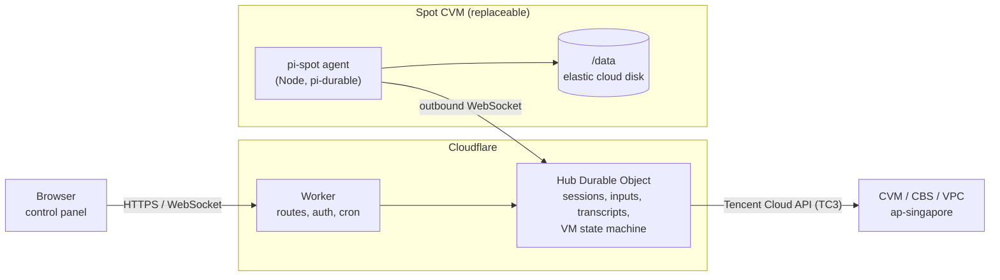

# pi-spot: durable pi agents on Tencent Cloud spot VMs

Run [pi-durable](https://github.com/earendil-works/pi/tree/main/packages/durable) coding agents on cheap Tencent Cloud
spot instances (竞价实例) in Singapore, controlled from a Cloudflare Worker.

- A web page on the Worker lists sessions and lets you chat with them, with live streaming.
- The Worker starts a spot CVM when a session has work, and terminates it after all sessions have been idle for a while.
- When Tencent reclaims the VM, the Worker launches a replacement, moves the data disk over, and the interrupted runs
  continue where they stopped.



The VM needs no inbound ports: the agent dials out to the Worker.

## What survives a VM replacement

Everything that matters lives on one elastic cloud disk (`/data`), 30 GB by default. The disk is created with
"release with instance" off, and it moves from VM to VM. After 30 idle minutes it is saved as a snapshot and deleted,
and the next start restores it (see [Lifecycle](#lifecycle)).

| Data | Where | How it persists |
|---|---|---|
| pi-durable sessions (transcripts, tasks, checkpoints) | `/data/pi/sessions/<id>/session.sqlite` | Data disk. On boot the agent calls `harness.resume()`. |
| Git working trees, including uncommitted changes and stashes | `/data/work/<session-id>` | Data disk. A stale `.git/index.lock` is removed on boot. Optionally a WIP snapshot is pushed on reclaim (`"PI_WIP_PUSH": "1"` in `AGENT_ENV`). |
| gh / git credentials | `GH_TOKEN` in the `AGENT_ENV` secret | Delivered to the agent on every connect and never written to disk. git gets it through `gh auth git-credential`. |
| Git identity, `~/.config`, shell history | `HOME=/data/home` | Data disk. |
| Model logins (Claude Pro/Max, ChatGPT, Copilot, API keys entered in the panel) | Hub Durable Object | Cloudflare, in pi's `auth.json` format. Delivered to the agent on connect and kept only in its memory; refreshed OAuth tokens are sent back. Never on the data disk or in its snapshots. |
| Model API keys from `AGENT_ENV` | `AGENT_ENV` secret | Delivered on every connect. |
| Node.js | `/data/cache/node-*` | Downloaded once, then reused. |
| Global `AGENTS.md`, skills and MCP servers | `/data/home/.pi/agent/` (`AGENTS.md`, `skills/`, `mcp.json`), `/data/home/.agents/skills/` | Data disk; see [What pi features the agent has](#what-pi-features-the-agent-has). |
| Session list, queued messages, approval requests and answers, transcript mirror | Hub Durable Object | Cloudflare. Available while no VM is running. |

What does **not** survive: running processes (dev servers, watchers), and system packages installed with `sudo apt` on
the system disk.

### How an interrupted run continues

pi-durable records each tool call before running it. After a restart:

- Model requests that were in flight are sent again.
- Tool calls that were in flight are not re-run. The model gets an `interrupted` result and decides what to do next.
- The agent's system prompt tells it to check real state (`git status`, `gh pr list`) before repeating side effects.
- Every user message carries a `requestId`, so messages redelivered after a reconnect are never submitted twice.

## Lifecycle

| Event | What the Hub does |
|---|---|
| A session has work (new session, queued message, or busy when the VM died) and no VM exists | 1. If no disk exists, creates one: from the latest snapshot if there is one, otherwise empty. It goes in the zone with the best matching spot capacity.<br>2. Picks the best matching spot type in the disk's zone.<br>3. Calls `RunInstances` (SPOTPAID) with a boot script.<br>4. Attaches the disk once the instance is RUNNING. |
| Agent connects | Sends secrets, sessions and queued messages. The agent opens every session and resumes unfinished work. |
| Spot reclaim notice (agent polls `metadata.tencentyun.com/.../spot/termination-time` every 5 s) | 1. Launches the replacement immediately; the reclaimed type goes on a 30-minute cooldown.<br>2. The old agent keeps working until 60 s before the reclaim, then checkpoints, syncs and stops.<br>3. The Hub detaches the disk from the old VM, terminates it, and attaches the disk to the new VM. |
| VM disappears without notice | The Hub finds it gone or terminating, then launches and attaches a replacement. |
| Agent offline for 5 minutes, or never connects within 20 minutes | The Hub replaces the VM. |
| All sessions idle for `idleMinutes` | The Hub tells the agent to shut down, then detaches the disk and terminates the VM. The disk stays. |
| The only work left waits for approval | Counts as idle: after `idleMinutes` the VM stops. Answering starts a VM, and the call continues with your answer. |
| Disk idle for `archiveAfterMinutes` (default 30) | 1. Snapshots the disk.<br>2. Deletes the disk once the snapshot is complete. If work arrives first, the disk is kept and the snapshot becomes the backup.<br>3. Deletes the previous snapshot once the new one is complete. While idle you pay only for the snapshot; a start takes 1–3 minutes longer. |
| No matching spot capacity in the disk's zone for 10 minutes | 1. Snapshots the disk and creates a copy in a zone that has capacity.<br>2. Continues there.<br>3. Keeps the old disk and snapshot for you to delete. |

The Hub schedules itself with Durable Object alarms. Alarms are stored durably and retried by Cloudflare if they fail.
- Every user action (new session, message, abort, start, stop) arms an alarm immediately.
- While a VM exists or is starting, the Hub checks every 10–30 s.
- With no VM and no work, nothing runs and no Tencent API is called.

The 15-minute cron is only a watchdog. Instances carry the tag `pi-spot=<NAME_PREFIX>`; tagged instances the Hub
doesn't know about are terminated.

## What pi features the agent has

The agent runs pi-durable rather than the `pi` CLI, and adds pi's pieces on top. pi's own durable coding agent lives
in pi's repository under `packages/coding-agent/src/experimental/durable`, but it isn't published, so these are
ports of it (MIT):

| Feature | Status |
|---|---|
| `read`, `write`, `edit`, `bash` tools | pi-durable's, the same four core tools as pi. Reading images is not supported yet. |
| System prompt | pi's sections and tool guidance, plus rules for running on a replaceable spot VM. |
| Context files | pi's rules: `AGENTS.override.md`, `AGENTS.md` or `CLAUDE.md` from `~/.pi/agent`, then from each directory from `/` down to the session's working directory. Re-read at most every 30 s. |
| Skills | pi 1.0's locations and order: the workspace's `.pi/skills/`, then `.agents/skills/` in the workspace and each parent up to the repository root, then `~/.pi/agent/skills/` and `~/.agents/skills/`. The first skill of a name wins; `disable-model-invocation` hides one. |
| MCP servers | pi's `mcp.json` files: `~/.pi/agent/mcp.json`, then the workspace's `.pi/mcp.json`. See [MCP servers](#mcp-servers). |
| Approvals | Per session: **auto** runs every tool call; **ask me** holds edits, writes, shell commands and MCP calls until you approve them. See [Approvals](#approvals). |
| Subagents | A `subagent` tool, as in pi's durable agent: it runs a task in a child conversation with the same tools and returns the answer. It survives a VM replacement. |
| Compaction | Automatic, from pi-durable: background summaries near the context limit, plus one retry after a context overflow. **Compact context** in a session's **⋯** menu runs it now, with optional instructions. |
| New context | **New context** in the **⋯** menu starts a fresh context from an optional handoff note; the history stays stored. |
| Retries, steering, follow-ups, abort, per-session model and thinking level, cost | From pi-durable. |
| Not available | codemode and tool search, MCP OAuth sign-in, pi extensions and packages, prompt templates, `@file` mentions, `!` commands (use the web terminal), branching (fork/tree) in the UI. |

Put shared instructions in `~/.pi/agent/AGENTS.md`, skills in `~/.pi/agent/skills/` or `~/.agents/skills/`, and MCP
servers in `~/.pi/agent/mcp.json` on the data disk (`HOME` is `/data/home`). The agent can create them itself if you
ask a session to.

### MCP servers

The format is pi's (and Claude Code's, Cursor's):

```json
{
  "mcpServers": {
    "github": { "url": "https://api.githubcopilot.com/mcp/", "headers": { "Authorization": "Bearer ${GH_TOKEN}" } },
    "playwright": { "command": "npx", "args": ["-y", "@playwright/mcp", "--headless"] }
  }
}
```

- **Transports:** stdio (`command`, `args`, `env`, `cwd`) and streamable HTTP (`url`, `headers`). SSE is not supported.
- **Values:** `env` and `headers` values expand `${NAME}` from the agent's environment, which includes `AGENT_ENV`, or
  run `!command` when the command is the whole value.
- **Tool names:** `mcp__<server>__<tool>`.
- **Exposure:** every tool is declared to the model directly. `exposure` or `toolExposure` set to `hidden` hides
  tools; pi's codemode and tool search do not exist here, so their exposures behave like `direct`.
- **Other options:** `timeout` (seconds, default 60) and `enabled: false` work as in pi. OAuth sign-in to remote
  servers is not supported; put a token in `headers` instead.
- **Connecting:** each session starts its own servers in its workspace. Before resuming, it waits up to 10 s for them,
  so an interrupted run finds the tools it called. The session header shows how many servers and tools are connected;
  hover it for errors.
- **Reloading:** after changing a file, use **⋯ → Reload MCP servers**.

### Approvals

Each session has an approval mode, set in **New session** or in the session header:
- **auto** (the default) runs every tool call.
- **ask me** holds every call of `edit`, `write`, `bash` and MCP tools until you answer. `read` and `subagent` never
  ask; a subagent's own calls do.

While a call waits:
- An **Approve** / **Deny…** card appears above the message box, and the tab title shows the count.
- A denial can carry a reason, which the model sees.
- Switching the session to **auto** approves everything waiting.

Answers are durable. If the VM stops while a call waits, the request stays in the panel. Waiting alone does not keep
the VM running: after `idleMinutes` it stops. Your answer starts a new VM, and the call continues there. The answer is
recorded with the tool call, so a VM replacement never asks twice.

## Web terminal

**Open shell** in a session's **⋯** menu opens a terminal in that session's workspace. It runs in a tmux session named
`pi-<first 8 characters of the session ID>`. **Menu → Open shell** in the top bar opens a VM-wide one, tmux session `pi-shell`,
in `HOME`.
- **Reattaching:** opening a shell runs `tmux new-session -A`, so it reattaches when the tmux session exists.
- **Closing:** closing the dialog only detaches. The tmux session keeps running until the VM is replaced; a new VM
  starts fresh ones.
- **Environment:** the shell runs as the agent's user, with the agent's environment (including `AGENT_ENV`, so `gh`
  works) and passwordless sudo.

There is no extra port or daemon. The bytes travel over the connections that already exist: browser ⇄ Hub ⇄ the
agent's outbound WebSocket. On the VM a small Python helper gives tmux a real pseudo-terminal, including window
resizes. Anyone with `ADMIN_TOKEN` gets a root-capable shell on the VM, which is one more reason to put Cloudflare
Access in front of the page.

In the message box, Enter sends and Shift+Enter starts a new line.

## Model logins and subscriptions

**Logins** in the control panel runs pi's own login flows on the VM:

1. Pick a provider, for example *Anthropic (subscription)*, *OpenAI (subscription)*, *GitHub Copilot* or *xAI*.
2. Pick **Sign in** or **Enter an API key**.
3. The panel shows what the flow needs:
   - a sign-in link (copy back the code it shows),
   - or a device code to enter on the provider's site.

   For flows that redirect to `localhost`, copy the address of the page that fails to load and paste it.

The control panel keeps the credential: the Hub stores it in pi's `auth.json` format and sends it to each new agent,
which holds it only in memory. Logins therefore survive replacing the VM and deleting the data disk, and they never
end up in a disk snapshot.

To bring an existing `pi` login over, copy its `auth.json` to `~/.pi/agent/auth.json` on the VM (with no saved logins
in the panel yet) and restart the agent with `sudo systemctl restart pi-spot-agent`. On start, an agent moves that
file into the Hub and deletes it from the disk. Agents from before this change saved logins there, so the first start
after upgrading moves them the same way.

How pi-durable uses it:
- The agent builds its pi-ai `Models` with a credential store backed by the Hub's copy, and every session's Harness
  resolves auth through it on each model request.
- A saved credential takes precedence over environment keys for the same provider.
- OAuth tokens are refreshed when they near expiry. The rotated tokens go to the Hub, and are resent after a
  reconnect until the Hub confirms them.

Picking a subscription model:
- After a login, the agent reports the models that credential can use; subscription plans may offer fewer.
- These models fill the model pickers: **New session**, **Settings → Default model**, and the model selector in each
  session's header.
- Switching a session's model takes effect from its next request.
- Models are named `provider/modelId`. For example, `anthropic/claude-sonnet-5` uses your Claude subscription once
  Anthropic is signed in, and the Anthropic API key otherwise.

Logins need a running VM. If none is up, the dialog offers **Start VM**.

## Choosing the spot instance

These settings can be set in `wrangler.jsonc` as defaults, or changed at runtime in the control panel's **Settings**.
**Preview matching instances** in Settings shows the live candidate list.

| Setting | Meaning |
|---|---|
| `minCpu`, `minMemoryGb` | Minimum vCPUs and memory (GB). |
| `maxHourlyPrice` | Upper limit on the spot price per hour for CPU and memory, in your account currency. Disks and traffic are billed separately. Also used as the spot bid. |
| `category` | `general` (S/SA/SN families), `compute` (C/CN), `memory` (M/MA), or `any`. Matching types rank first. |
| `zones` | Zones allowed for a new data disk. Empty means all Singapore zones. |
| `idleMinutes` | Idle time before the VM is stopped. |

How a type is chosen:
1. Candidates come from `DescribeZoneInstanceConfigInfos` with `instance-charge-type=SPOTPAID`.
2. ARM, GPU, FPGA, bare-metal and out-of-stock types are dropped.
3. The rest are sorted by preferred category, then price, then stock level.
4. If a launch fails with a capacity error, the next candidate is tried.

## Setup

### 1. Tencent Cloud

1. Use an account that can buy spot instances in `ap-singapore`.
2. Create a CAM sub-user with programmatic access only, and attach this policy:

```json
{
  "version": "2.0",
  "statement": [
    {
      "effect": "allow",
      "action": [
        "cvm:RunInstances", "cvm:DescribeInstances", "cvm:TerminateInstances",
        "cvm:DescribeZoneInstanceConfigInfos", "cvm:DescribeImages",
        "cvm:CreateDisks", "cvm:DescribeDisks", "cvm:AttachDisks", "cvm:DetachDisks",
        "cvm:ModifyDiskAttributes", "cvm:TerminateDisks",
        "cvm:CreateSnapshot", "cvm:DescribeSnapshots", "cvm:DeleteSnapshots",
        "cvm:DescribeSecurityGroups", "cvm:CreateSecurityGroup",
        "vpc:CreateSecurityGroupWithPolicies", "vpc:CreateSecurityGroupPolicies", "vpc:CreateDefaultVpc",
        "finance:trade",
        "tag:*"
      ],
      "resource": ["*"]
    }
  ]
}
```

CAM checks some calls under names that differ from the API:
- cloud-disk (CBS) calls use the `cvm:` prefix;
- `CreateSecurityGroupWithPolicies` is checked as `cvm:CreateSecurityGroup`;
- `RunInstances` also needs `finance:trade`, the permission to pay for what it launches.

If a call fails with `UnauthorizedOperation`, the control panel log names the missing action. Add it to the policy, or
use the broader preset policies `QcloudCVMFullAccess`, `QcloudVPCFullAccess` and `QcloudTAGFullAccess`.

### 2. Cloudflare: deploy on push (Workers Builds)

1. Push this repository to GitHub.
2. In the Cloudflare dashboard, go to **Workers & Pages → Create → Import a repository** and pick the repository.
   Then set:
   - **Project name**: `pi-durable-tecentcloud-cvm-spot`. It must match `name` in `wrangler.jsonc`; change both if you want another name.
   - **Root directory**: the repository root (default). `wrangler.jsonc` and `package-lock.json` live there.
   - **Build command**: leave empty. `wrangler deploy` runs the `build` hook in `wrangler.jsonc`, which bundles the
     agent into `worker/public/agent/agent.mjs`. The bundle is a build output and is not committed.
   - **Deploy command**: `npx wrangler deploy` (default).
3. Under **Settings → Build → Branch control**, turn off builds for non-production branches. Preview versions of this
   Worker would share the production Durable Object, the one that controls the VMs.
4. Under **Settings → Variables and Secrets**, add these as type *Secret*:
   - `ADMIN_TOKEN`
   - `TENCENTCLOUD_SECRET_ID`
   - `TENCENTCLOUD_SECRET_KEY`
   - `AGENT_ENV`

   Secrets survive later deploys. Plain variables come from `wrangler.jsonc` on every deploy, so change them there,
   not in the dashboard.
5. Open the Worker URL and enter `ADMIN_TOKEN`. The Worker remembers this origin as the address new VMs connect back
   to. Set `PUBLIC_URL` in `wrangler.jsonc` only if VMs should use a different hostname.

`AGENT_ENV` is a JSON object of environment variables for the agent, for example:

```json
{"ANTHROPIC_API_KEY": "sk-ant-...", "GH_TOKEN": "github_pat_...", "GIT_USER_NAME": "pi bot", "GIT_USER_EMAIL": "pi@example.com"}
```

Any provider pi-ai supports works (`OPENAI_API_KEY`, `DEEPSEEK_API_KEY`, ...). Pick the default model with
`DEFAULT_MODEL` (`provider/modelId`). Use a fine-grained GitHub token limited to the repositories the agent should touch.

Putting [Cloudflare Access](https://developers.cloudflare.com/cloudflare-one/applications/) in front of `/*`, with a
bypass for `/api/agent/ws` and `/agent/*`, is strongly recommended in addition to the token.

To deploy from your machine instead, run `npm install`, set the secrets with `npx wrangler secret put <NAME>`, and run
`npm run deploy` from the repository root.

A deploy only changes the agent for VMs started after it. A running VM keeps its agent until it is replaced.

### Optional knobs (`wrangler.jsonc` vars)

| Var | Default | Notes |
|---|---|---|
| `DATA_DISK_TYPE` / `DATA_DISK_GB` | `CLOUD_BSSD` / `30` | Used when a data disk is created; a disk restored from a snapshot is at least as large as the one it was taken from. |
| `ARCHIVE_AFTER_MINUTES` | `30` | Idle minutes before the data disk is snapshotted and deleted. Empty keeps it. Also in Settings. |
| `SYSTEM_DISK_TYPE` / `SYSTEM_DISK_GB` | `CLOUD_BSSD` / `30` | Billed only while a VM runs. |
| `BANDWIDTH_MBPS` | `100` | Billed by traffic. |
| `NODE_MAJOR` | `24` | Node.js major version installed on the VM. |
| `AGENT_SUDO` | `true` | Passwordless sudo for the agent user. |
| `ALLOW_ZONE_MIGRATION` | `true` | Snapshot-based move to another zone when capacity runs out. |
| `KEY_IDS`, `SSH_CIDR` | empty | SSH key pair IDs and a CIDR allowed to reach port 22, for debugging. |
| `VPC_ID` + `SUBNET_ID`, `SECURITY_GROUP_ID`, `IMAGE_ID` | auto | Defaults: the default VPC and subnet, an egress-only security group `pi-spot-agent`, and the newest public Ubuntu 24.04 image. |

## Development

```bash
npm run typecheck
npm test            # TC3 signer, instance ranking, boot script, pi prompt and skills, MCP, approvals, credentials
npm run test:e2e    # real Worker + real agent processes against a Tencent Cloud simulator
```

`npm run test:e2e` runs `sim/tencent-sim.mjs` (a fake CVM/CBS/VPC API and metadata service whose instances are local
agent processes) and checks these scenarios:
- launch, pi's prompt, skills, subagents, compaction and new context,
- logins moving from `auth.json` to the Hub, and an MCP tool call (`sim/mcp-echo.mjs`),
- a spot reclaim in the middle of a run,
- idle shutdown, disk archive and restore, and an instance lost without notice,
- approve and deny in ask mode, and an approval answered while no VM runs,
- deleting the data disk without losing logins.

To try the UI without any cloud, set `CLOUD_MODE=local`, `ADMIN_TOKEN` and `LOCAL_AGENT_TOKEN` in `.dev.vars` at
the repository root, then run `npm run dev` and start an agent next to it:

```bash
PI_HUB_URL=http://127.0.0.1:8787 PI_INSTANCE_ID=local PI_AGENT_TOKEN=<LOCAL_AGENT_TOKEN> PI_DATA_DIR=./.local-data PI_FAUX=1 node worker/public/agent/agent.mjs
```

`PI_FAUX=1` registers a scripted `faux/faux-1` model, so no API key is needed.

## Operating notes

- **Logs.** The control panel shows the Hub log, including agent logs. On the VM:
  - `/var/log/pi-spot-bootstrap.log` has the boot script output.
  - `journalctl -u pi-spot-agent` has the agent output.
- **Costs.**
  - The data disk is billed while it exists. Once it has been idle for `archiveAfterMinutes`, only its snapshot is
    billed until the next start.
  - The VM is billed only while it runs; the spot price covers CPU and memory only.
  - Public traffic is billed per GB.
- **Archiving** a session (**⋯ → Archive**) stops its run and closes it; its files stay on the data disk.
  **Archived sessions** (under the session list, or in the top menu) lists them for batch **Resume** or **Delete**.
  - Resume reopens a session right away if a VM is online, otherwise on the next start.
  - Delete removes the session for good: its transcript, its pi-durable state, its workspace (including uncommitted
    changes) and its tmux session. With no VM online, the files are removed when the next VM connects.
- After a zone migration, the log names the old disk and snapshot to delete.

## Caveats

- Only tested against the simulator, not a live Tencent Cloud account. Expect to adjust details on the first real
  deploy, such as:
  - CAM actions,
  - `CLOUD_BSSD` availability for a given instance family,
  - the default-VPC behaviour of `CreateDefaultVpc` on your account.
- `@earendil-works/pi-durable` is experimental and its API changes without notice. It is pinned to `1.0.0`.
- One VM serves all sessions.
- Tencent disks can only grow. To get a smaller disk, use **Menu → Delete data disk** while no VM exists. It deletes the
  disk, its snapshots, session state, workspaces and pi's user files (`~/.pi/agent`, `~/.agents`), and archives all
  sessions. Saved logins stay. The next start creates an empty disk at the size set in Settings.
- The agent can read every secret in `AGENT_ENV`, because it needs them to work. Scope tokens accordingly.
- If the reclaim notice is missed (abrupt loss), side effects of the step in flight, such as `git push` or opening a
  PR, can happen again when the model retries. The system prompt asks it to check first.
- The Worker is the control point: a new VM cannot start working until it reaches the Worker, because that is how it
  receives its secrets.
