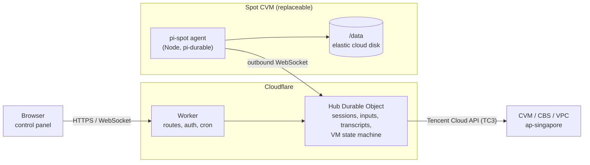

# pi-spot: durable pi agents on Tencent Cloud spot VMs

Run [pi-durable](https://github.com/earendil-works/pi/tree/main/packages/durable) coding agents on cheap Tencent Cloud
spot instances (竞价实例) in Singapore, controlled from a Cloudflare Worker.

- A web page on the Worker lists sessions and lets you chat with them, with live streaming.
- The Worker starts a spot CVM when a session has work, and terminates it after all sessions have been idle for a while.
- When Tencent reclaims the VM, the Worker launches a replacement, moves the data disk over, and the interrupted runs
  continue where they stopped.



The VM needs no inbound ports: the agent dials out to the Worker.

## What survives a VM replacement

Everything that matters lives on one elastic cloud disk (`/data`). The disk is created with "release with instance"
off, and it moves from VM to VM.

| Data | Where | How it persists |
|---|---|---|
| pi-durable sessions (transcripts, tasks, checkpoints) | `/data/pi/sessions/<id>/session.sqlite` | Data disk. On boot the agent calls `harness.resume()`. |
| Git working trees, including uncommitted changes and stashes | `/data/work/<session-id>` | Data disk. A stale `.git/index.lock` is removed on boot. Optionally a WIP snapshot is pushed on reclaim (`"PI_WIP_PUSH": "1"` in `AGENT_ENV`). |
| gh / git credentials | `GH_TOKEN` in the `AGENT_ENV` secret | Delivered to the agent on every connect and never written to disk. `gh auth setup-git` makes git use it. |
| Git identity, `~/.config`, shell history | `HOME=/data/home` | Data disk. |
| Model logins (Claude Pro/Max, ChatGPT, Copilot, API keys entered in the panel) | `/data/home/.pi/agent/auth.json` | Data disk, in pi's own format. Refreshed OAuth tokens are written back. |
| Model API keys from `AGENT_ENV` | `AGENT_ENV` secret | Delivered on every connect. |
| Node.js | `/data/cache/node-*` | Downloaded once, then reused. |
| Session list, queued messages, transcript mirror | Hub Durable Object | Cloudflare. Available while no VM is running. |

What does **not** survive: running processes (dev servers, watchers), and system packages installed with `sudo apt` on
the system disk.

### How an interrupted run continues

pi-durable records each tool call before running it. After a restart:

- Model requests that were in flight are sent again.
- Tool calls that were in flight are not re-run. The model gets an `interrupted` result and decides what to do next.
- The agent's system prompt tells it to check real state (`git status`, `gh pr list`) before repeating side effects.
- Every user message carries a `requestId`, so messages redelivered after a reconnect are never submitted twice.

## Lifecycle

| Event | What the Hub does |
|---|---|
| A session has work (new session, queued message, or busy when the VM died) and no VM exists | 1. Creates the data disk on first use.<br>2. Picks the best matching spot type in the disk's zone.<br>3. Calls `RunInstances` (SPOTPAID) with a boot script.<br>4. Attaches the disk once the instance is RUNNING. |
| Agent connects | Sends secrets, sessions and queued messages. The agent opens every session and resumes unfinished work. |
| Spot reclaim notice (agent polls `metadata.tencentyun.com/.../spot/termination-time` every 5 s) | 1. Launches the replacement immediately; the reclaimed type goes on a 30-minute cooldown.<br>2. The old agent keeps working until 60 s before the reclaim, then checkpoints, syncs and stops.<br>3. The Hub detaches the disk from the old VM, terminates it, and attaches the disk to the new VM. |
| VM disappears without notice | The Hub finds it gone or terminating, then launches and attaches a replacement. |
| Agent offline for 5 minutes, or never connects within 20 minutes | The Hub replaces the VM. |
| All sessions idle for `idleMinutes` | The Hub tells the agent to shut down, then detaches the disk and terminates the VM. The disk stays. |
| No matching spot capacity in the disk's zone for 10 minutes | 1. Snapshots the disk and creates a copy in a zone that has capacity.<br>2. Continues there.<br>3. Keeps the old disk and snapshot for you to delete. |

The Hub schedules itself with Durable Object alarms. Alarms are stored durably and retried by Cloudflare if they fail.
- Every user action (new session, message, abort, start, stop) arms an alarm immediately.
- While a VM exists or is starting, the Hub checks every 10–30 s.
- With no VM and no work, nothing runs and no Tencent API is called.

The 15-minute cron is only a watchdog. Instances carry the tag `pi-spot=<NAME_PREFIX>`; tagged instances the Hub
doesn't know about are terminated.

## Model logins and subscriptions

**Logins** in the control panel runs pi's own login flows on the VM:

1. Pick a provider, for example *Anthropic (subscription)*, *OpenAI (subscription)*, *GitHub Copilot* or *xAI*.
2. Pick **Sign in** or **Enter an API key**.
3. The panel shows what the flow needs:
   - a sign-in link (copy back the code it shows),
   - or a device code to enter on the provider's site.

   For flows that redirect to `localhost`, copy the address of the page that fails to load and paste it.

The credential is saved to `~/.pi/agent/auth.json` on the data disk. That is the file the `pi` CLI uses too, so you
can also copy an existing `auth.json` there.

How pi-durable uses it:
- The agent builds its pi-ai `Models` with a credential store backed by that file, and every session's Harness
  resolves auth through it on each model request.
- A saved credential takes precedence over environment keys for the same provider.
- OAuth tokens are refreshed when they near expiry, and the rotated tokens are written back to the disk.

Picking a subscription model:
- After a login, the agent reports the models that credential can use; subscription plans may offer fewer.
- These models fill the model pickers: **New session**, **Settings → Default model**, and the model selector in each
  session's header.
- Switching a session's model takes effect from its next request.
- Models are named `provider/modelId`. For example, `anthropic/claude-sonnet-5` uses your Claude subscription once
  Anthropic is signed in, and the Anthropic API key otherwise.

Logins need a running VM. If none is up, the dialog offers **Start VM**.

## Choosing the spot instance

These settings can be set in `wrangler.jsonc` as defaults, or changed at runtime in the control panel's **Settings**.
**Preview matching instances** in Settings shows the live candidate list.

| Setting | Meaning |
|---|---|
| `minCpu`, `minMemoryGb` | Minimum vCPUs and memory (GB). |
| `maxHourlyPrice` | Upper limit on the spot price per hour for CPU and memory, in your account currency. Disks and traffic are billed separately. Also used as the spot bid. |
| `category` | `general` (S/SA/SN families), `compute` (C/CN), `memory` (M/MA), or `any`. Matching types rank first. |
| `zones` | Zones allowed for a new data disk. Empty means all Singapore zones. |
| `idleMinutes` | Idle time before the VM is stopped. |

How a type is chosen:
1. Candidates come from `DescribeZoneInstanceConfigInfos` with `instance-charge-type=SPOTPAID`.
2. ARM, GPU, FPGA, bare-metal and out-of-stock types are dropped.
3. The rest are sorted by preferred category, then price, then stock level.
4. If a launch fails with a capacity error, the next candidate is tried.

## Setup

### 1. Tencent Cloud

1. Use an account that can buy spot instances in `ap-singapore`.
2. Create a CAM sub-user with programmatic access only, and attach this policy:

```json
{
  "version": "2.0",
  "statement": [
    {
      "effect": "allow",
      "action": [
        "cvm:RunInstances", "cvm:DescribeInstances", "cvm:TerminateInstances",
        "cvm:DescribeZoneInstanceConfigInfos", "cvm:DescribeImages",
        "cbs:CreateDisks", "cbs:DescribeDisks", "cbs:AttachDisks", "cbs:DetachDisks",
        "cbs:ModifyDiskAttributes", "cbs:CreateSnapshot", "cbs:DescribeSnapshots",
        "vpc:DescribeSecurityGroups", "vpc:CreateSecurityGroupWithPolicies",
        "vpc:CreateSecurityGroupPolicies", "vpc:CreateDefaultVpc",
        "tag:*"
      ],
      "resource": ["*"]
    }
  ]
}
```

If a call fails with `UnauthorizedOperation`, the control panel log names the missing action. Add it to the policy, or
use the preset `QcloudCVMFullAccess` + `QcloudCBSFullAccess` + `QcloudVPCFullAccess` policies.

### 2. Cloudflare: deploy on push (Workers Builds)

1. Push this repository to GitHub.
2. In the Cloudflare dashboard, go to **Workers & Pages → Create → Import a repository** and pick the repository.
   Then set:
   - **Project name**: `pi-durable-tecentcloud-cvm-spot`. It must match `name` in `wrangler.jsonc`; change both if you want another name.
   - **Root directory**: the repository root (default). `wrangler.jsonc` and `package-lock.json` live there.
   - **Build command**: leave empty. `wrangler deploy` runs the `build` hook in `wrangler.jsonc`, which bundles the
     agent into `worker/public/agent/agent.mjs`. The bundle is a build output and is not committed.
   - **Deploy command**: `npx wrangler deploy` (default).
3. Under **Settings → Build → Branch control**, turn off builds for non-production branches. Preview versions of this
   Worker would share the production Durable Object, the one that controls the VMs.
4. Under **Settings → Variables and Secrets**, add these as type *Secret*:
   - `ADMIN_TOKEN`
   - `TENCENTCLOUD_SECRET_ID`
   - `TENCENTCLOUD_SECRET_KEY`
   - `AGENT_ENV`

   Secrets survive later deploys. Plain variables come from `wrangler.jsonc` on every deploy, so change them there,
   not in the dashboard.
5. Open the Worker URL and enter `ADMIN_TOKEN`. The Worker remembers this origin as the address new VMs connect back
   to. Set `PUBLIC_URL` in `wrangler.jsonc` only if VMs should use a different hostname.

`AGENT_ENV` is a JSON object of environment variables for the agent, for example:

```json
{"ANTHROPIC_API_KEY": "sk-ant-...", "GH_TOKEN": "github_pat_...", "GIT_USER_NAME": "pi bot", "GIT_USER_EMAIL": "pi@example.com"}
```

Any provider pi-ai supports works (`OPENAI_API_KEY`, `DEEPSEEK_API_KEY`, ...). Pick the default model with
`DEFAULT_MODEL` (`provider/modelId`). Use a fine-grained GitHub token limited to the repositories the agent should touch.

Putting [Cloudflare Access](https://developers.cloudflare.com/cloudflare-one/applications/) in front of `/*`, with a
bypass for `/api/agent/ws` and `/agent/*`, is strongly recommended in addition to the token.

To deploy from your machine instead, run `npm install`, set the secrets with `npx wrangler secret put <NAME>`, and run
`npm run deploy` from the repository root.

A deploy only changes the agent for VMs started after it. A running VM keeps its agent until it is replaced.

### Optional knobs (`wrangler.jsonc` vars)

| Var | Default | Notes |
|---|---|---|
| `DATA_DISK_TYPE` / `DATA_DISK_GB` | `CLOUD_BSSD` / `100` | Used when the data disk is first created. |
| `SYSTEM_DISK_TYPE` / `SYSTEM_DISK_GB` | `CLOUD_BSSD` / `50` | |
| `BANDWIDTH_MBPS` | `100` | Billed by traffic. |
| `NODE_MAJOR` | `24` | Node.js major version installed on the VM. |
| `AGENT_SUDO` | `true` | Passwordless sudo for the agent user. |
| `ALLOW_ZONE_MIGRATION` | `true` | Snapshot-based move to another zone when capacity runs out. |
| `KEY_IDS`, `SSH_CIDR` | empty | SSH key pair IDs and a CIDR allowed to reach port 22, for debugging. |
| `VPC_ID` + `SUBNET_ID`, `SECURITY_GROUP_ID`, `IMAGE_ID` | auto | Defaults: the default VPC and subnet, an egress-only security group `pi-spot-agent`, and the newest public Ubuntu 24.04 image. |

## Development

```bash
npm run typecheck
npm test            # TC3 signer matches the official SDK, instance ranking, boot script
npm run test:e2e    # real Worker + real agent processes against a Tencent Cloud simulator
```

`npm run test:e2e` runs `sim/tencent-sim.mjs` (a fake CVM/CBS/VPC API and metadata service whose instances are local
agent processes) and checks four scenarios:
- launch,
- a spot reclaim in the middle of a run,
- idle shutdown,
- an instance lost without notice.

To try the UI without any cloud, set `CLOUD_MODE=local`, `ADMIN_TOKEN` and `LOCAL_AGENT_TOKEN` in `.dev.vars` at
the repository root, then run `npm run dev` and start an agent next to it:

```bash
PI_HUB_URL=http://127.0.0.1:8787 PI_INSTANCE_ID=local PI_AGENT_TOKEN=<LOCAL_AGENT_TOKEN> PI_DATA_DIR=./.local-data PI_FAUX=1 node worker/public/agent/agent.mjs
```

`PI_FAUX=1` registers a scripted `faux/faux-1` model, so no API key is needed.

## Operating notes

- **Logs.** The control panel shows the Hub log, including agent logs. On the VM:
  - `/var/log/pi-spot-bootstrap.log` has the boot script output.
  - `journalctl -u pi-spot-agent` has the agent output.
- **Costs.**
  - The data disk is billed continuously, even with no VM running.
  - The VM is billed only while it runs; the spot price covers CPU and memory only.
  - Public traffic is billed per GB.
- **Archiving** a session hides it and stops its run. Its files stay on the data disk.
- After a zone migration, the log names the old disk and snapshot to delete.

## Caveats

- Only tested against the simulator, not a live Tencent Cloud account. Expect to adjust details on the first real
  deploy, such as:
  - CAM actions,
  - `CLOUD_BSSD` availability for a given instance family,
  - the default-VPC behaviour of `CreateDefaultVpc` on your account.
- `@earendil-works/pi-durable` is experimental and its API changes without notice. It is pinned to `1.0.0`.
- One VM serves all sessions.
- The agent can read every secret in `AGENT_ENV`, because it needs them to work. Scope tokens accordingly.
- If the reclaim notice is missed (abrupt loss), side effects of the step in flight, such as `git push` or opening a
  PR, can happen again when the model retries. The system prompt asks it to check first.
- The Worker is the control point: a new VM cannot start working until it reaches the Worker, because that is how it
  receives its secrets.
